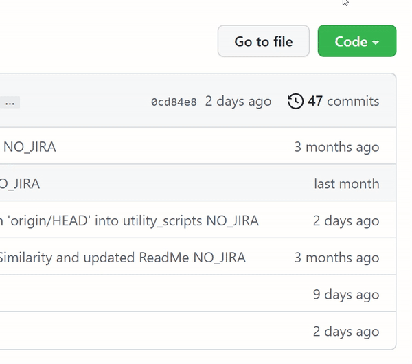
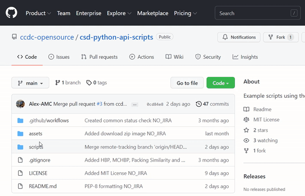

# CSD Python API Scripts

A repository containing scripts that have been created to leverage the toolkit found within
the [CCDC portfolio](https://www.ccdc.cam.ac.uk/solutions/) that are accessible via
the [CSD Python API](https://www.ccdc.cam.ac.uk/solutions/csd-core/components/csd-python-api/).

The purpose of this platform is to distribute knowledge and allow for scientific collaborations. Scripts are provided on an as-is basis and while their use is not supported we do welcome feedback on potential improvements. All scripts are tested against the latest version of the CSD Python API as installed with the CSD Portfolio.

> For feedback or to report any issues please contact [support@ccdc.cam.ac.uk](mailto:support@ccdc.cam.ac.uk)

## Content 

```graphql
.
├─ assets                  # Images for documentation
├─ scripts                 # Python scripts 
├─ LICENSE
└─ README.md
```

## Licensing Requirements 

Valid CSD Portfolio licence is required for all scripts, some will require additional licence levels for use, such as Discovery and Materials. Requirements are clearly displayed in the `ReadMe` that accompanies each script. 

Don’t have a licence? Contact us [here to request a quote or demonstration.](https://www.ccdc.cam.ac.uk/theccdcprofile/contactus/)

## Downloading Scripts

We advise that users `fork` the repository to ensure they can keep up to date with any modification.
If you don't want to worry about having a GitHub account or are not confident with Git, you can download the scripts straight from this webpage. 

The following section will outline how to download multiple or individual scripts: 

### 1. Downloading All Scripts in a Zip file 

Whilst in the main repository window click `Code` and select `Download Zip`:



### 2. Downloading Individual Scripts

Once you've found a script/file you wish to download, click on it. This will show you the content of the file. In the top right of the file click `Raw`. 
This will open the content in a tab where you can `Right-Click` in the text and select `"Save As..."`. 

You will be asked to in your file explorer where you wish to save the file. Please specify the file extension at this point, by default `.txt` is used (For python scripts `.py` is required.)  



## Running scripts through the CSD Python API Miniconda installed 
This requires you to already have the CSD Python API installed. 

Windows: 
```cmd
"<CCDC_INSTALL_LOCATION>\CCDC\Python_API_2022\miniconda\Scripts\activate.bat"
python script_example.py
```

## Submitting or Modifying Scripts

1. [Create a Fork of the repository](https://docs.github.com/en/get-started/quickstart/contributing-to-projects#forking-a-repository) (A fork is a copy of a repository that you manage. Forks let you make changes to a project without affecting the CSD GitHub repo. You can fetch updates from or submit changes to the CSD GitHub repo with pull requests.)

2. [Commit your changes to the forked repository](https://docs.github.com/en/get-started/quickstart/contributing-to-projects#making-and-pushing-changes) (on a branch). 

3. [Create a Pull Request](https://docs.github.com/en/get-started/quickstart/contributing-to-projects#making-a-pull-request) to this repository.

4. Once the code has been reviewed it can be merged into the CSD GitHub repo by someone from the CCDC.