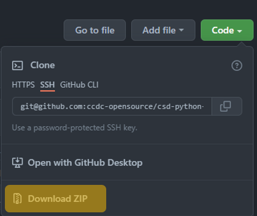

# CSD Python API Scripts


A repository containing scripts that have been created to leverage the toolkit found within
the [CCDC portfolio](https://www.ccdc.cam.ac.uk/solutions/) that are accessible via
the [CSD Python API](https://www.ccdc.cam.ac.uk/solutions/csd-core/components/csd-python-api/).

The purpose of this platform is to distribute knowledge and allow for scientific collaborations. Scripts are provided on an as-is basis and while their use is not supported we do welcome feedback on potential improvements. All scripts are tested against the latest version of the CSD Python API as installed with the CSD Portfolio.

> For feedback or to report any issues please contact [support@ccdc.cam.ac.uk](mailto:support@ccdc.cam.ac.uk)

## Content 

```graphql
.
├─ assets                  # Images for documentation
├─ scripts                 # Python scripts 
├─ LICENSE
└─ README.md  
```

## Licensing Requirements 

Valid CSD Portfolio licence is required for all scripts, some will require additional licence levels for use, such as Discovery and Materials. Requirements are clearly displayed in the `ReadMe` that accompanies each script. 

Don’t have a licence? Contact us [here to request a quote or demonstration.](https://www.ccdc.cam.ac.uk/theccdcprofile/contactus/)

## Downloading Scripts

This section will focus on how to download multiple or individual scripts: 

### 1. Downloading All Scripts 


#### Downloading Zip file: 
Click `Code` and Select `Download Zip`:




### 2. Downloading Individual Scripts

#### TODO - Add gif of downloading single file
#### TODO - write instructions on how to download


## Running scripts through the CSD Python API Miniconda installed 

This requires you to already have the CSD Python API installed. 

Windows: 
```cmd
"<CCDC_INSTALL_LOCATION>\CCDC\Python_API_2022\miniconda\Scripts\activate.bat"
python script_example.py
```
