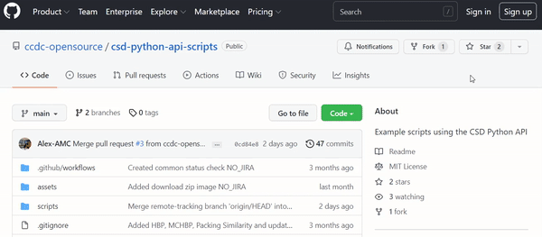

## Contents

This folder contains scripts submitted by users or CCDC scientists for anyone to use freely. 

### Hydrogen bond propensity
- Writes a `.docx report` of a hydrogen bond propensity calculation for any given `.mol2`/refcode.

### Multi-component hydrogen bond propensity 
- Performs a multi-component HBP calculation for a given library of co-formers. 

### Packing similarity dendrogram
- Construct a dendrogram for an input set of structures based on packing-similarity analysis.

### GOLD-multi
- Use the CSD Docking API and the multiprocessing module to parallelize GOLD docking.

### Find Binding Conformation
- Generates idealized conformers for ligands and evaluates their RMSD to the conformation in the PDB.

### Concat Mol2
- Concatenates mol2 files present in working directory to a single `.mol2` file. 

### Create CASTEP Input
- Creates input files (`.cell` and `.param`) files for a given compound through Mercury.

### Create GAUSSIAN Input
- Create GAUSSIAN input file (`.gjf`) for a given CSD refcode or `.mol2` file.

### Particle Rugosity
- Calculates the simulated BFDH particle rugosity weighted by facet area.

## Tips 
A section for top tips in using the repository and GitHub. 
### Searching tips:

The search bar in GitHub allows you to search for keywords mentioned in any file throughout the repository (in the main branch).

It is also possible to filter which file type you are interested in.

For example: 
"hydrogen bond" 

