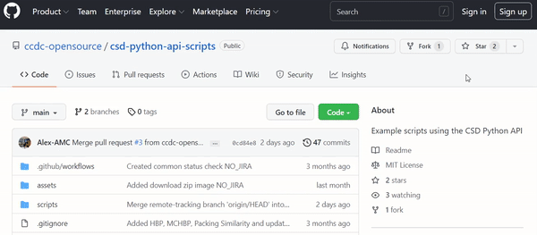

# Contents

This folder contains scripts submitted by users or CCDC scientists for anyone to use freely.

## Assorted Utilities

Various scripts with no specific licence requirements that may be useful for a variety of purposes.

| Script | Description |
|--------|-------------|
| Concat Mol2 | Concatenates mol2 files present in working directory to a single `.mol2` file. |

## Core

| Script | Description |
|--------|-------------|
| Conformer demo | A short script to generate conformers with some rudimentary analysis for a single molecule. |
| Conformer Filter Density | A script to filter conformers based on a variety of torsion metrics. |
| Create CASTEP Input | Creates input files (`.cell` and `.param`) files for a given compound through Mercury. |
| Create GAUSSIAN Input | Create GAUSSIAN input file (`.gjf`) for a given CSD refcode or `.mol2` file. |
| Filter poses | A script to filter docking poses based on torsion statistics |
| MOF subset 2017 Chem Mater publication | Two scripts that were supplementary information in the publication "Development of a Cambridge Structural Database Subset: A Collection of Metal–Organic Frameworks for Past, Present, and Future" DOI: <https://doi.org/10.1021/acs.chemmater.7b00441> |
| Refcodes With Properties | A script for generating refcode lists with specific properties from an easy-to-read control file. |
| Show semiconductor properties | Displays semiconductor properties for the structure currently loaded in Mercury. |
| Void Search | A script to search on pre-calculated Void properties. |

## Discovery

| Script | Description |
|--------|-------------|
| Find Binding Conformation | Generates idealized conformers for ligands and evaluates their RMSD to the conformation in the PDB. |
| GOLD-multi | Use the CSD Docking API and the multiprocessing module to parallelize GOLD docking. |

## Materials

| Script | Description |
|--------|-------------|
| Multi-component hydrogen bond propensity | Performs a multi-component HBP calculation for a given library of co-formers. |
| Packing similarity dendrogram | Construct a dendrogram for an input set of structures based on packing-similarity analysis. |

## Particle

| Script | Description |
|--------|-------------|
| Hydrogen bond propensity | Writes a `.docx report` of a hydrogen bond propensity calculation for any given `.mol2`/refcode. |
| November 2023 morphology webinar | A collection of scripts from the November 2023 CCDC Webinar on crystal morphologies. |
| Particle Rugosity | Calculates the simulated BFDH particle rugosity weighted by facet area. |
| Surface Charge | Calculates the surface charge for a given structure and surface terminations. Runs both from CMD and Mercury. |

## Searching tips

The search bar in GitHub allows you to search for keywords mentioned in any file throughout the repository (in the main branch).

It is also possible to filter which file type you are interested in.

For example:
"hydrogen bond"

