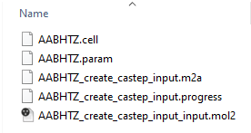
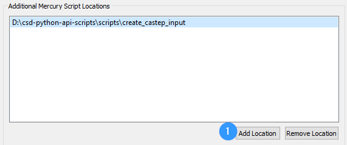
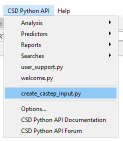

# Create CASTEP Input

## Summary

Allows the user to generate a set of CASTEP input files (.cell and .params) for a structure viewed in Mercury. 

## Requirements

Tested with CSD Python API 3.0.9

Requires user to add script to Mercury interface. 

## Licensing Requirements

- CSD-Core

If you wish to run CASTEP, you will need to acquire a licence for CASTEP, this is not supplied by the CCDC.

## Instructions on running

Add script with Folder to Mercury interface (Mercury -> CSD Python API-> Options -> Add Location)

Select refcode of interest or load structure into Mercury. 

Select script from CSD Python API dropdown. 

## Author

_Anthony Reilly_ (2016)

> For feedback or to report any issues please contact [support@ccdc.cam.ac.uk](mailto:support@ccdc.cam.ac.uk)