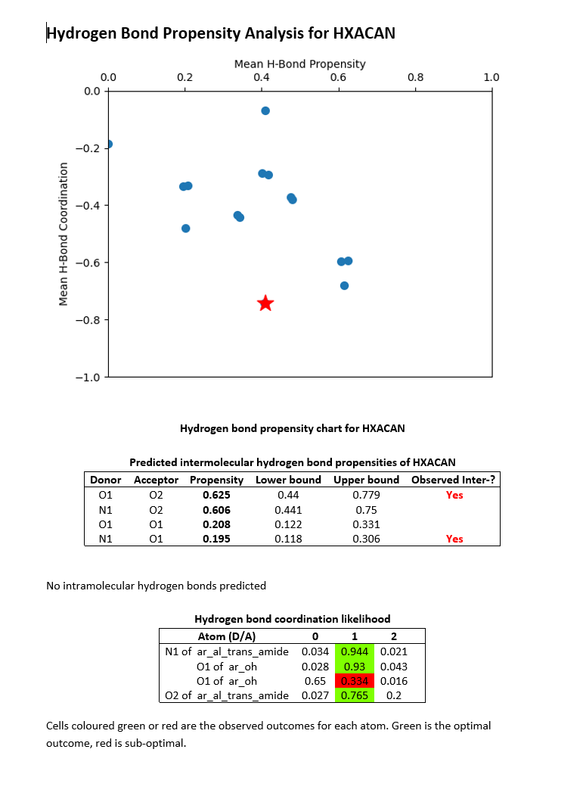
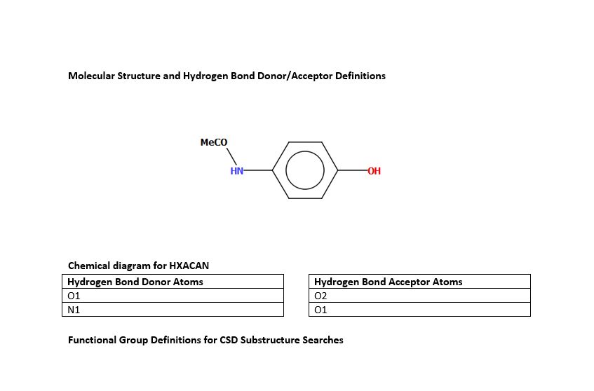
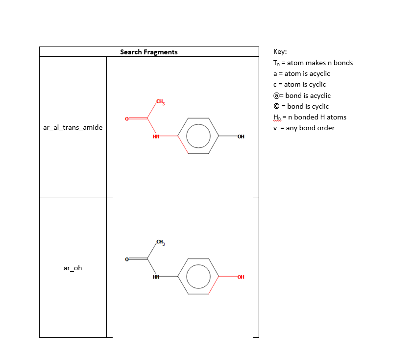
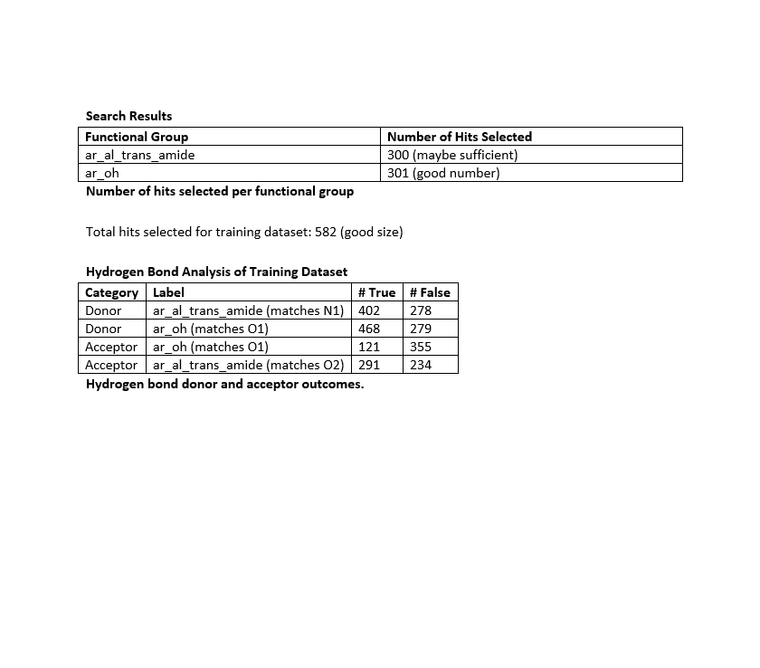

# Hydrogen Bond Propensity 

Writes a .docx report of a hydrogen bond propensity calculation

----
Included in the report:
- Hydrogen bond propensity chart.
- Table of Predicted intermolecular hydrogen bond propensities. 
- Table of Hydrogen bond coordination likelihood.
- Table of Hydrogen Bond Donor/Acceptor Definitions 
- Functional Group Definitions for CSD Substructure Searches
  - Search Results
  - Number of hits selected per functional group
  - Hydrogen Bond Analysis of Training Dataset
  - Hydrogen bond donor and acceptor outcomes

## Example 

 





## Requirements 

- ```matplotlib, docxtpl, msgpack```

- hydrogen_bond_propensity_report.docx
## Licensing Requirements 
- CSD-Core

## Instructions on running

Using mol2 file 

```cmd
"C:\Program Files\CCDC\Python_API_2022\miniconda\Scripts\activate.bat"
python hydrogen_bond_propensity_report.py structure.mol2 
```

Options: 
```
- d | --directory - sets the working directory 
- n | --noopen - Do not automatically open the generated output file.
```
## Author

_Andrew Maloney_(2017)

> For feedback or to report any issues please contact [support@ccdc.cam.ac.uk](mailto:support@ccdc.cam.ac.uk)
