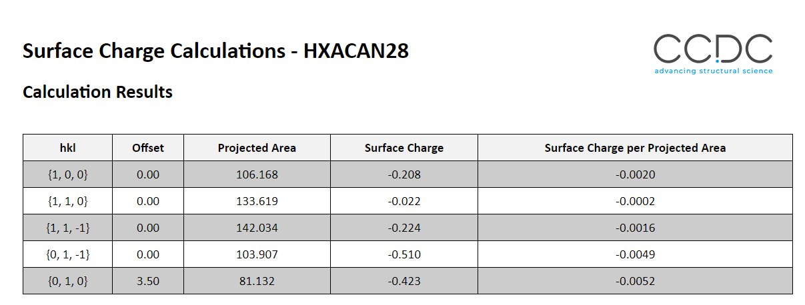

# Surface Charge Calculator

## Summary

This tool returns the surface charge for a given structure and list of supplied hkl and offsets. 
The script provides a GUI that can be used from Mercury or from the command line. 

The output is a HTML file with a table for all the all selected surfaces and their associated charge, projected surface areas and normalised surface charge. 

Charges are currently calculated using Gasteiger charges. Further development could be made to use user derived charges. Please let me know if that is something you'd like [amoldovan@ccdc.cam.ac.uk](amoldovan@ccdc.cam.ac.uk).

Example Output: 


> **Note** - When comparing charges for structures out of the CSD and from mol2 files the values might be different as the bonding might not be the same. When importing a mol2 the bonding and charges have to be calculated on the fly. Whereas the CSD structures the bonding is pre-assigned. 

## Requirements

- Requires a minimum of CSD 2022.2 

## Licensing Requirements

- CSD-Particle Licence

## Instructions on Running

- To Run from command line:
```commandline
# With an activated environment
> python surface_charge.py
```
- To run from mercury: 
Add the folder containing the script to your Python API menu. Mercury -> CSD Python API-> Options -> Add Location. Then just select the `surface_charge.py` script from the drop down menu


Running either from the command line or Mercury you will get the same interface allowing you to select a refcode from the CSD or input a mol2 file directly.

Example input : 


## Author

Alex Moldovan (2024)

> For feedback or to report any issues please contact [support@ccdc.cam.ac.uk](mailto:support@ccdc.cam.ac.uk)