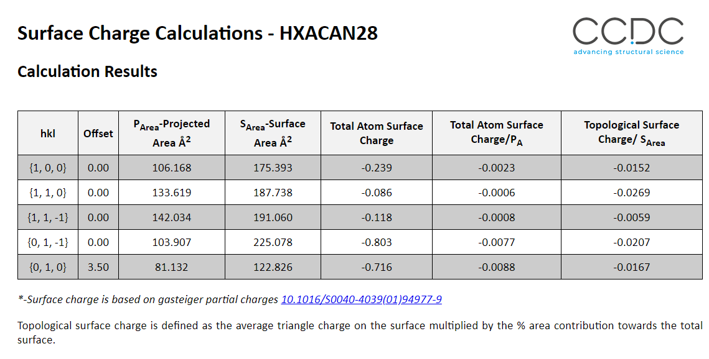

# Surface Charge Calculator

## Summary

This tool returns the total surface charges for a given structure and list of supplied hkl indices and offsets.
The script provides a GUI that can be used from Mercury or from the command line.

The output is an HTML file with a table for all the selected surfaces and their associated charges, projected surface areas, and normalised surface charges (surface charge per projected area).

Charges are currently calculated using the Gasteiger charge model. Further development could be made to use user derived charges. Please let us know if that is of interest: [support@ccdc.cam.ac.uk](support@ccdc.cam.ac.uk).

Example Output:



> **Note** - When comparing charges for non-CSD structures and structures from mol2 files the values might be different as the bonding might not be the same. When importing a mol2 file the bonding and charges may have to be calculated on the fly, whereas this information is assigned for CSD entries.

## Requirements

- Requires a minimum of CSD 2022.2

## Licensing Requirements

- CSD-Particle Licence

## Instructions for use

- To Run from command line:

```commandline
# With an activated environment
> python surface_charge.py
```

- To run from mercury:
Add the folder containing the script to your Python API menu. Mercury -> CSD Python API-> Options -> Add Location. Then select the `surface_charge.py` script from the drop down menu


Running from either the command line or Mercury will show the same interface allowing you to select a refcode from the CSD or input a mol2 file directly.

Example Input:


## Author

Alex Moldovan (2024)

> For feedback or to report any issues please contact [support@ccdc.cam.ac.uk](mailto:support@ccdc.cam.ac.uk)